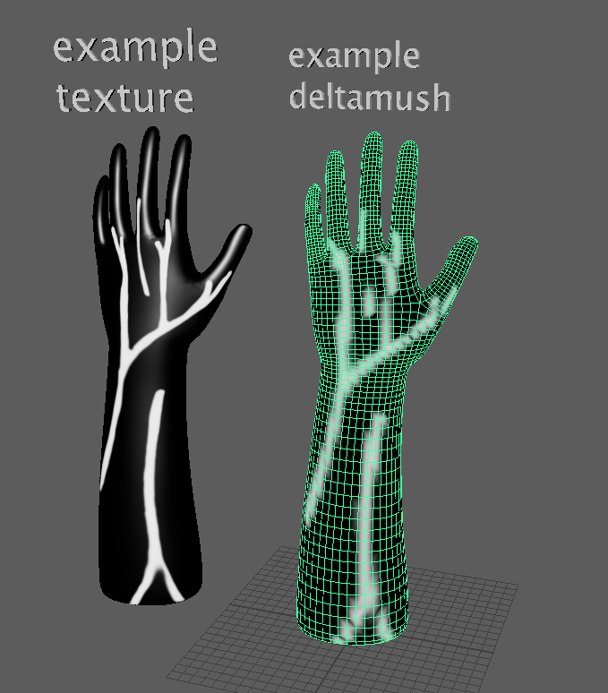

<!-- PROJECT LOGO -->
<br />
<div align="center">
  <a href="https://github.com/NCCA/pipeline-project-Robijn98/tree/main/images">
    
  </a>
  <h3 align="center">Maya Transfer Node</h3>
  
</div>

<!-- ABOUT THE PROJECT -->
## About The Project

This is a node for maya you can use to turn colour information into weights. 


### Built With
<div align="center">
  
[](#)


</div>

<!-- GETTING STARTED -->
## Getting Started
### Prerequisites

To run you will need the following 
- maya 2023
(will probably run in other version but hasn't been tested)
- maya api libary

### Installation
Clone the repo
   ```sh
   git clone https://github.com/NCCA/pipeline-project-Robijn98.git
   ```
<!-- USAGE EXAMPLES -->
## Usage

To use the program you can simply clone the repo or download the dragdrop folder. 
Make sure that when you are using the drag and drop both the transfernode and the 
install script are located in the same folder than drop the dragdrop in a maya scene,
this will put the transfernode into the right folder. If the dragdrop doesn't work you can 
manually install by placing the transfernode.py file in your maya plugin folder probably 
located at:

windows: drive:\\Program Files\\Autodesk\\Maya<version>\\bin\\plug-ins

mac: /Applications/Autodesk/maya<version>/Maya.app/Contents/MacOS/plug-ins

linux: /usr/autodesk/maya<version>/bin/plug-ins

Once installed, restart maya, you can now in the plugins manager load the plugin. 
To create the node run the following code in a python tab:
   ```sh
cmds.createNode("transfer_py") 
   ```
Connect outcolor of the file or 2D placed texture you want to use to determine weight to the inColor. 
Connect outMesh from the shapenode of the used mesh to the inputMesh, make sure you don't use the same
mesh as the mesh that has the deformer or you are in generally connecting weights too. You can now connect
the weights to the weights of what you are using. In the attribute editor you can adjust the color being used
for main input, you can switch between red, green, blue, average or brightness. 
 
<br />
<div align="center">
  <a href="https://github.com/NCCA/pipeline-project-Robijn98/tree/main/images">
    
  </a>

  
</div>

You should now be able to see the weights being represented, for instance if you used deltamush to connect the weights
you can go into the paintmode to see the weights being applied. Please be aware because you've plugged something in the 
weights you can't paint it anymore, it will reset. 

<br />
<div align="center">
  <a href="https://github.com/NCCA/pipeline-project-Robijn98/tree/main/images">
    
  </a>

  
</div>

<!-- ACKNOWLEDGMENTS -->
## Acknowledgments
